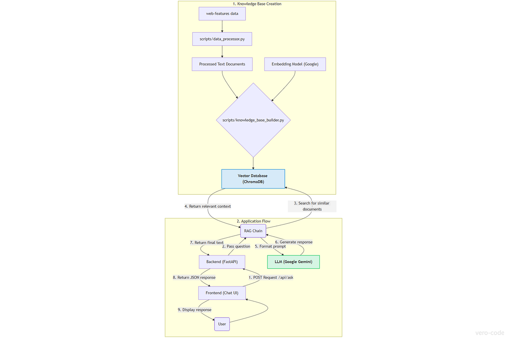
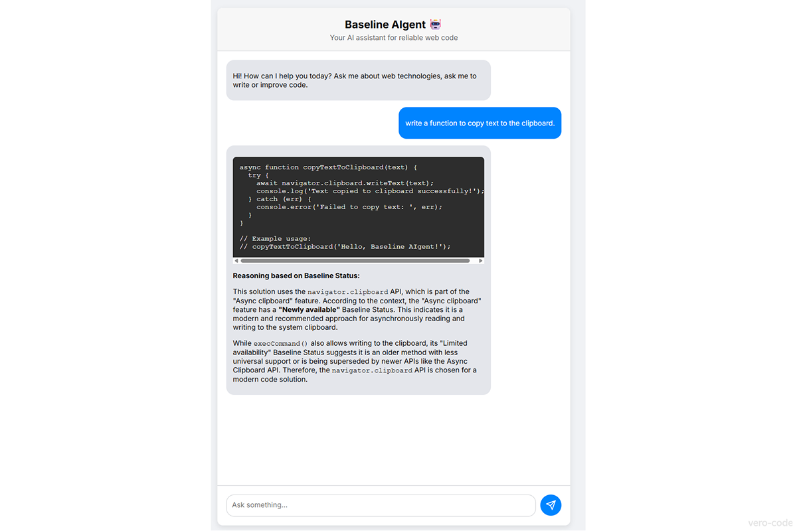

# Baseline AIgent 🤖
[](https://web.dev/baseline/)
[](https://aws.amazon.com/what-is/retrieval-augmented-generation/)
[](https://www.python.org/)

An intelligent AI assistant for web developers that generates reliable, cross-browser compatible code based on the Baseline standard.

This project is a submission for the [**Baseline Tooling Hackathon**](https://devpost.com/software/baseline-aigent).

| Project Architecture Diagram | Baseline AIgent UI |
|--|--|
|  |  |

## The Problem: The "AI Trust Gap"

Modern AI assistants are powerful but often unreliable for professional web development. They are trained on a decade of outdated internet content and can generate code that:

-   Uses deprecated APIs.
    
-   Lacks cross-browser compatibility.
    
-   Relies on obsolete techniques.
    

This forces developers to manually verify every line of AI-generated code, defeating the purpose of an assistant.

## The Solution: An AI Grounded in Truth

**Baseline AIgent** solves this problem by using a **Retrieval-Augmented Generation (RAG)** architecture. It doesn't guess based on the entire internet; its knowledge is exclusively grounded in the official `web-features` dataset.

This ensures that every piece of code and every answer is:

-   **Reliable:** Based on the official Baseline standard.
    
-   **Modern:** Uses the latest, safest web technologies.
    
-   **Production-Ready:** Guaranteed to be cross-browser compatible.
    

## Features

-   **✅ Smart Code Generation:** Ask for a function, and get a modern, Baseline-compatible implementation.
    
-   **🔄 Legacy Code Refactoring:** Provide old code (e.g., jQuery) and get a safe, vanilla JS alternative.
    
-   **❓ Direct Q&A:** Ask about any web feature's compatibility and get an instant, accurate answer based on its Baseline status.
    

## Tech Stack

-   **Data Source:** Baseline (`web-features` dataset)

-   **Backend:** Python, FastAPI
    
-   **AI Core:** LangChain, Google Gemini API (`gemini-2.5-flash`)
    
-   **Knowledge Base:** ChromaDB (Vector Database)
    
-   **Frontend:** Vanilla HTML, CSS, JavaScript
    

## How to Run Locally

1.  **Clone the repository:**
    
    ```
    git clone https://github.com/vero-code/baseline-aigent.git
    cd baseline-aigent
    ```
    
2.  **Set up the Python environment:**
    
    ```
    python -m venv venv
    source venv/bin/activate  # On Windows: .\venv\Scripts\activate
    pip install -r requirements.txt
    ```
    
3.  **Set up your API Key:**
    
    -   Create a `.env` file in the root directory.
        
    -   Add your Google AI Studio API key: `GOOGLE_API_KEY="your_api_key_here"`
        
4.  **Build the Knowledge Base:**
    
    -   Download the source data: `python scripts/download_data.py`
        
    -   Process the data: `python scripts/data_processor.py`
        
    -   Build the vector database: `python scripts/knowledge_base_builder.py`
        
5.  **Run the application:**
    
    -   Start the FastAPI server: `uvicorn app.main:app --reload`
        
    -   Open the `frontend/index.html` file in your browser.

## Contributing

Contributions are welcome! As this is a hackathon project, the primary goal was to build a functional MVP. If you have ideas for improvements or new features, feel free to fork the repository or open an issue to discuss them.

## License

This project is licensed under the MIT License - see the [LICENSE](LICENSE) file for details.